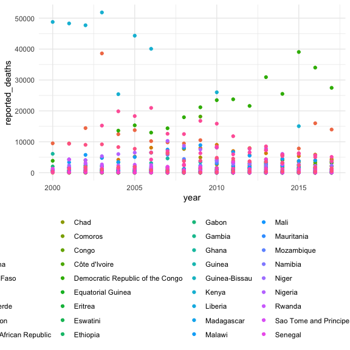

Mortality
================
Nidhi Patel
11/10/2020

``` r
library(tidyverse)
```

    ## ── Attaching packages ─────────────────────────────────────── tidyverse 1.3.0 ──

    ## ✓ ggplot2 3.3.2     ✓ purrr   0.3.4
    ## ✓ tibble  3.0.3     ✓ dplyr   1.0.2
    ## ✓ tidyr   1.1.2     ✓ stringr 1.4.0
    ## ✓ readr   1.3.1     ✓ forcats 0.5.0

    ## ── Conflicts ────────────────────────────────────────── tidyverse_conflicts() ──
    ## x dplyr::filter() masks stats::filter()
    ## x dplyr::lag()    masks stats::lag()

``` r
library(rvest)
```

    ## Loading required package: xml2

    ## 
    ## Attaching package: 'rvest'

    ## The following object is masked from 'package:purrr':
    ## 
    ##     pluck

    ## The following object is masked from 'package:readr':
    ## 
    ##     guess_encoding

``` r
library(httr)
library(plotly)
```

    ## 
    ## Attaching package: 'plotly'

    ## The following object is masked from 'package:httr':
    ## 
    ##     config

    ## The following object is masked from 'package:ggplot2':
    ## 
    ##     last_plot

    ## The following object is masked from 'package:stats':
    ## 
    ##     filter

    ## The following object is masked from 'package:graphics':
    ## 
    ##     layout

``` r
knitr::opts_chunk$set(
  fig.width = 6,
  fig.height = 6,
  out.width = "90%")

theme_set(theme_minimal() + theme(legend.position = "bottom"))

options(
  ggplot2.continuous.colour = "viridis",
  ggplot2.continuous.fill = "viridis"
)

scale_color_discrete = scale_colour_viridis_d
scale_fill_discrete = scale_fill_viridis_d
```

## Mortality rates - reported

Scrape a table

[Mortality Rates
Reported](https://apps.who.int/gho/athena/data/GHO/MALARIA001.html?profile=ztable&filter=COUNTRY:*)

``` r
url = "https://apps.who.int/gho/athena/data/GHO/MALARIA001.html?profile=ztable&filter=COUNTRY:*"

reported = read_html(url)
```

extract the table(s)

``` r
reported = reported %>% 
  html_nodes(css = "table") %>% 
  first() %>% 
  html_table() %>%
  as_tibble() %>% 
  janitor::clean_names() %>% 
  select(country, year, region, numeric_value) %>% 
  rename(reported_deaths = numeric_value)
```

## Mortality rates - estimated

Scrape a table

[Mortality Rates
Estimated](https://apps.who.int/gho/athena/data/GHO/MALARIA003.html?profile=ztable&filter=COUNTRY:*)

``` r
url = "https://apps.who.int/gho/athena/data/GHO/MALARIA003.html?profile=ztable&filter=COUNTRY:*"

estimated = read_html(url)
```

extract the table

``` r
estimated = estimated %>% 
  html_nodes(css = "table") %>% 
  first() %>% 
  html_table() %>%
  as_tibble() %>% 
  janitor::clean_names() %>% 
  select(country, year, region, numeric_value, low_range, high_range) %>% 
  rename(estimated_deaths = numeric_value, 
         low_est = low_range,
         high_est = high_range)
```

## Merge tables

``` r
burden = 
  left_join(reported, estimated, by = c("country" = "country", "year" = "year", "region" = "region")) %>% 
  write_csv("./data/mortality.csv")
```

## Plot

``` r
burden %>% 
  filter(region %in% "Africa") %>% 
  ggplot(aes(x = year, y = reported_deaths, color = country)) + 
  geom_point() 
```



``` r
  # theme(legend.title = element_blank()) %>% 
  # geom_boxplot(y = upper_limit = high_range, lower_limit = low_range)
```
